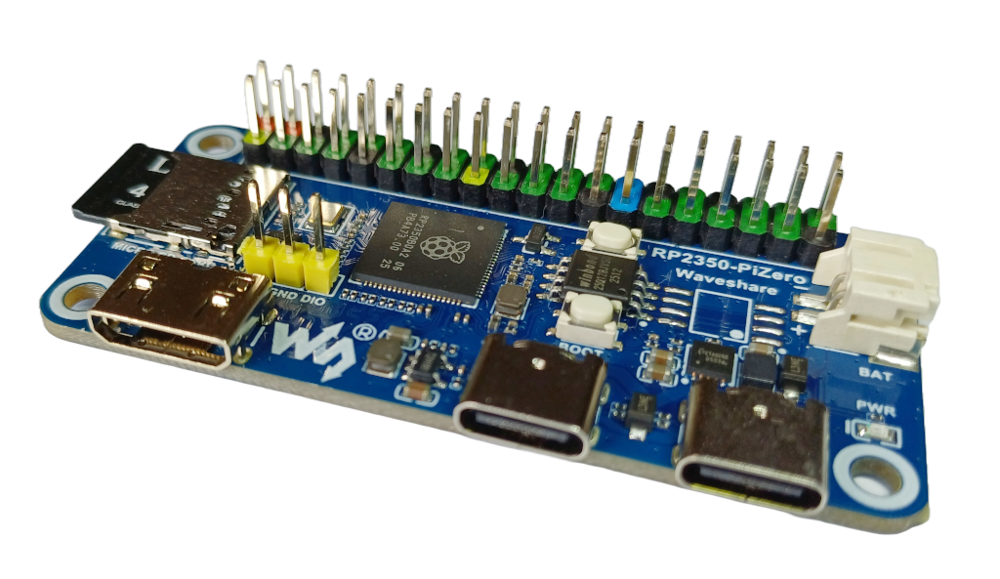

### ZxSpectrumRP2350PiZero
Waveshare RP2350-PiZero Development Board

It supports the following:
* USB keyboard
* USB joysticks
* 50/60Hz HDMI video
* HDMI audio
* SPI SD card
* Ringo's low resolution mode

#### Notes
* An OTG adapter is need to connect a USB keyboard to the primary USB
* Power can be provided by the secondary USB C port
* An adapter from Micro HDMI is needed for HDMI
* Audio output over HDMI

#### Firmware
| Display | Firmware |
| - | - |
| 720x576x50Hz | [ZxSpectrumRP2350PiZero_720x576x50Hz.uf2](/uf2-rp2350-arm-s/ZxSpectrumRP2350PiZero_720x576x50Hz.uf2) |
| 640x480x60Hz | [ZxSpectrumRP2350PiZero_640x480x60Hz.uf2](/uf2-rp2350-arm-s/ZxSpectrumRP2350PiZero_640x480x60Hz.uf2) |

### Parts
[RP2350-PiZero](https://www.waveshare.com/wiki/RP2350-PiZero)

#### References
[RP2350-PiZero](https://www.waveshare.com/wiki/RP2350-PiZero) 
[Circuit diagram](https://files.waveshare.com/wiki/RP2350-PiZero/RP2350-PiZero.pdf) 
[OTG Adapter]( https://www.amazon.co.uk/OTG/dp/B09CTSHZR7) 

#### Thanks
Thanks to [retrofan11](https://github.com/retrofan11) and [drewpo28](https://github.com/drewpo28) for hist help in getting this board up and running.
